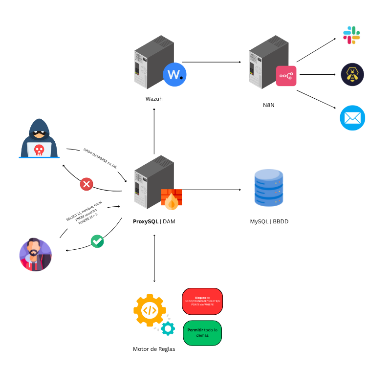

# 🛡️ Defensa Automatizada contra SQL Injection con ProxySQL, Wazuh & N8N

Sistema ligero y práctico para **detectar intentos de SQL Injection (SQLi), DROPs, TRUNCATEs o ALTERs** y **responder automáticamente**.

---

## ⚙️ TL;DR

- 🧠 **ProxySQL** inspecciona y registra queries sospechosas.  
- 🕵️ **Wazuh** detecta patrones (reglas) en los logs de ProxySQL.  
- 🧩 **N8N** integrado para notificaciones (correo, Slack, The Hive o bloquear IPs en Firewall.)
- 🧪 Diseñado para entornos **de testing o infraestructura controlada**.

📘 Podés encontrar el artículo completo en este [enlace al blog](https://blog.santiagoagustinfernandez.com/cuando-el-sql-se-pone-peligroso-automatizando-defensa-con-proxysql-y-wazuh)

---

## 🧱 Arquitectura Simplificada

  

---

## 🔍 Qué Hace Exactamente

- 🔎 **Detecta** patrones típicos de SQLi (`UNION`, `SLEEP`, `information_schema`, `stacked queries`, etc.).  
- 🧾 **Registra** las queries sospechosas en el log de ProxySQL.  
- 🚨 **Genera alertas** en Wazuh y ejecuta respuestas automáticas (por ejemplo, scripts que bloquean IPs).  
- 🧱 **No altera** el motor de base de datos: ProxySQL actúa como punto de control entre la aplicación y MySQL.  

> ⚠️ **Nota importante:**  
> *ProxySQL* es el motor que **filtra y decide** sobre las queries.  
> El bloqueo por `iptables` es una **acción reactiva opcional (Active Response)** para mitigar la IP origen; **no reemplaza** el filtrado de ProxySQL.

---

✍️ **Autor:** [Santiago Agustín Fernández](https://www.linkedin.com/in/safernandez666/)  
🔐 **Blog:** [https://blog.santiagoagustinfernandez.com](https://blog.santiagoagustinfernandez.com)  
